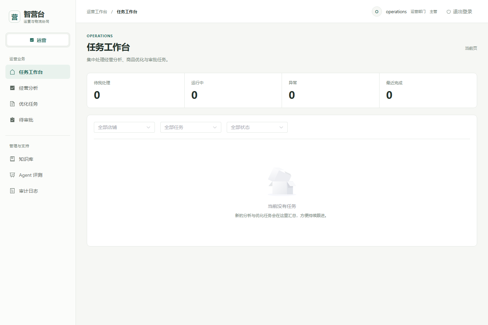
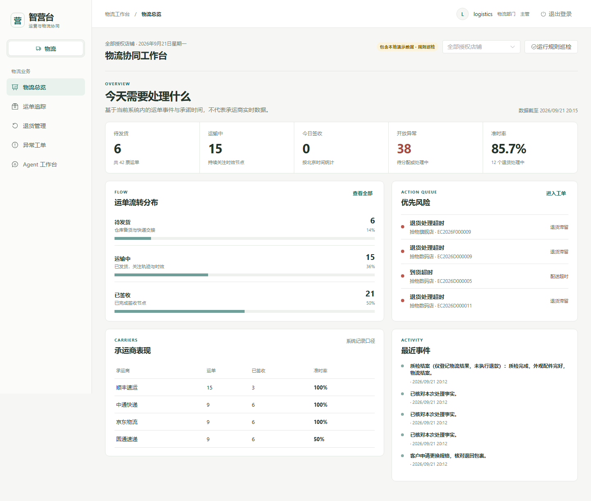
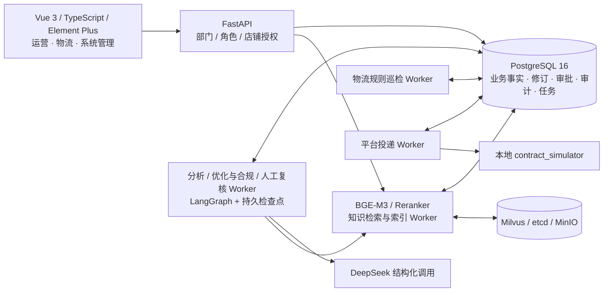

# 智营台 · 电商运营与物流协同 Agent 系统

面向多店铺电商团队的统一工作台，包含**运营部门、物流部门和系统管理**。运营侧完成“经营分析 → 商品优化 → 合规复核 → 人工审批 → 发布投递”，物流侧完成“运单登记 → 发货跟踪 → 到货签收 → 退货验收 → 异常处理”。两条业务链共用账号、店铺和订单事实，通过部门、角色及店铺范围隔离权限。

本仓库包含两部门的 Vue 前端、FastAPI 后端、数据库迁移、后台 Worker、演示脚本和测试。运营 Agent 使用 LangGraph 与 DeepSeek 结构化调用，物流 Agent 使用本地确定性规则；真实电商平台和承运商接入尚未实现。下文按当前代码说明能力及运行方式。

## 工作台与功能

| 工作区 | 页面入口 | 主要使用者 |
| --- | --- | --- |
| 运营工作台 | `/app/workbench`、`/app/analysis`、`/app/proposals`、`/app/approvals` | 运营员工、运营主管 |
| 物流工作台 | `/app/logistics`，通过 `?view=shipments`、`returns`、`exceptions`、`agent` 切换业务页 | 物流员工、物流主管 |
| 运营支持 | `/app/knowledge`、`/app/agent-evaluations`、`/app/audit-events` | 按角色开放的运营账号及管理员 |
| 系统管理 | `/app/admin` | 系统管理员 |

登录 `/app/` 后进入所属部门。管理员可以在统一侧栏切换运营与物流，并回到该部门最近访问的页面；普通账号只显示本部门入口。桌面端提供完整界面，运营手机端面向任务查看和主管审批，物流手机端提供业务导航与操作。

### 运营部门

| 模块 | 已实现内容 |
| --- | --- |
| 经营分析 | 在授权店铺中逐店聚合指标，识别低转化、销售下滑、高退款、库存风险；分析 Agent 在确定性事实基础上解释问题和给出建议 |
| 任务工作台 | 按店铺、任务状态等条件查看分析与优化任务，跟踪执行进度、质量状态及待处理事项 |
| 商品优化 | 从候选商品创建方案，生成标题、卖点、详情、关键词与属性补全；展示差异、可信商品事实、知识引用和不可变修订历史 |
| 合规与人工修订 | 确定性规则检查与独立合规 Agent 复核；最多两次自动修订，必要时转人工，人工新修订再次进入复核流程 |
| 主管审批 | 提交、批准、驳回和退回修改；批准时复核商品版本及权限，在事务内保存本地发布记录和平台投递任务 |
| 知识库与 RAG | 文档上传、版本索引与停用；本地 BGE-M3、Milvus 稠密/稀疏混合召回及重排，引用回查当前有效版本；管理员管理文档，运营账号可检索 |
| Agent 评测与可观测性 | CLI 运行固定离线评测；结果入库需显式开启写入并使用有效管理员身份；主管和管理员在界面查询评测结果、调用耗时、Token、错误码等安全元数据 |
| 平台投递 | 独立 Worker、幂等请求、限流与有界重试、同商品版本顺序控制，以及签名 Webhook 接收与重放验证；当前投递目标为本地契约模拟器 |

### 物流部门

| 模块 | 已实现内容 |
| --- | --- |
| 物流总览 | 待发货、在途、今日签收、未结异常、处理中退货、签收准时率，以及承运商分布和近期事件 |
| 运单追踪 | 从已有订单登记运单，按订单号/运单号、店铺、状态等查询，查看发货截止、实际发货、预计到货、实际签收和完整轨迹 |
| 节点录入 | 登记发货、运输节点和签收，校验时间顺序与状态转换；历史事件只追加，界面统一显示北京时间 |
| 退货管理 | 申请、批准或拒绝、退回运输、仓库收货、质检结案；查看预计退回、实际收货和结案时间 |
| 异常工单 | 检测发货超时、轨迹停滞、到货延误、退货超时，保存规则证据与处理建议，分配负责人并记录结案；相同触发证据去重 |
| 规则 Agent | 手动及定时巡检、运行历史、物流简报、带运单引用的业务问答；查询和巡检均遵守店铺权限 |
| CSV 导出 | 导出运单、退货、异常列表的**当前筛选页**，沿用接口可见范围 |

签收准时率的口径是“当前可见已签收运单中，实际签收时间不晚于预计到货时间的占比”，不等同于所有订单的履约率。发货和到货超时依据登记的承诺时间；轨迹停滞阈值为 48 小时，仓库收货后超过 24 小时未结案也会触发退货风险。问答与简报基于登记事实和规则，不调用物流大模型或实时承运商接口。

### 权限与管理

权限由 **部门 × 角色 × 店铺范围 × 业务动作** 共同决定，前端导航和后端接口同时约束。

| 身份 | 运营业务 | 物流业务 | 管理能力 |
| --- | --- | --- | --- |
| 运营员工 `operations / operator` | 授权店铺内发起分析、选品、修订和提交审批 | 拒绝 | 可检索知识；不能审批或管理账号 |
| 运营主管 `operations / supervisor` | 授权店铺内查看、复核和审批 | 拒绝 | 查看 Agent 评测、调用元数据和审计 |
| 物流员工或主管 `logistics / operator, supervisor` | 拒绝，包括运营知识库、评测和审计接口 | 授权店铺内运单、退货、异常与巡检 | 通过物流事件、处理记录和巡检历史追溯业务 |
| 管理员 `admin` | 可访问，保留动作级约束 | 可访问 | 修改已有用户的部门、角色、状态与店铺授权，维护店铺状态和知识文档 |

JWT 只用于确认身份；每次请求重新读取数据库中的用户状态与权限。后台任务在执行和写入边界复核授权，平台客户端在每次实际发布请求前复核权限。管理员变更部门后，旧登录凭证不能继续访问被撤销的业务。物流异常只能指派给有效且有对应店铺权限的物流账号或管理员。系统管理包含最后一个有效管理员保护，不提供公开注册。

| 运营工作台 | 物流工作台 |
| --- | --- |
|  |  |

## 技术架构



采用模块化单体和独立后台进程。运营任务通过 PostgreSQL 租约、`SKIP LOCKED`、检查点、有界重试和幂等约束恢复执行；物流巡检是按账号范围定期扫描的独立规则进程。Milvus 保存检索索引，PostgreSQL 保存知识的规范内容、版本和引用事实。本地物流轻量演示另外提供 SQLite 启动方式。

FastAPI 另有签名 Webhook 接收接口，由验收脚本独立发送签名回调验证；本地平台模拟器本身不自动发送回调。

```text
backend/                 API、权限、运营 Agent、知识、审批、物流与各类 Worker
frontend/src/            两部门工作台、管理页面、路由和权限控制
alembic/versions/        数据库迁移 0001—0009（含物流表及部门字段）
scripts/                数据初始化、Worker、评测与验收入口
tests/                  后端单元、API、并发、故障与显式开启的集成测试
frontend/tests/         运营、管理、手机端和真实物流服务浏览器测试
docs/                   使用说明、业务技术说明、设计计划与验收报告
start-logistics.ps1      本地物流轻量演示启动脚本
docker-compose.yml      PostgreSQL、Milvus、etcd、MinIO 开发依赖
```

## 运行方式

| 方式 | 适用场景 | 数据与依赖 |
| --- | --- | --- |
| 完整系统，默认 `8000` | 同时使用运营、物流与系统管理；运行运营 Agent、RAG 和持久 Worker | PostgreSQL；知识链路需要 Milvus 与本地 BGE；模型调用需配置模型服务 |
| 物流轻量演示，默认 `8010` | 快速体验物流流程、统一导航和部门隔离 | 独立 SQLite、合成物流数据及本地规则，无需 Docker、Milvus 或模型密钥 |

两个入口使用同一套前后端源码，但数据库和初始化内容不同。`8010` 演示库只初始化物流用的账号、店铺、订单和物流记录；其中的运营账号用于权限及导航验证，**不会生成完整运营商品数据，也不会启动运营 Agent Worker**。完整运营闭环请使用下面的 PostgreSQL 启动方式。

### 完整系统

需要 Python 3.11、Node.js 24 和 Docker Compose。以下 PowerShell 命令在仓库根目录执行：

```powershell
py -3.11 -m venv .venv
.\.venv\Scripts\Activate.ps1
python -c "import subprocess,sys,tomllib; p=tomllib.load(open('pyproject.toml','rb'))['project']; subprocess.check_call([sys.executable,'-m','pip','install',*p['dependencies'],*p['optional-dependencies']['test']])"
npm --prefix frontend ci
if (!(Test-Path .env.local)) { Copy-Item .env.example .env.local }
docker compose -p e-commerce_operations up -d
```

编辑本机 `.env.local`，按 [.env.example](.env.example) 和 [配置定义](backend/config.py) 设置：

| 配置 | 用途 |
| --- | --- |
| `JWT_SECRET_KEY` | 自行生成的随机签名密钥，API 和各 Worker 使用一致配置 |
| `DATABASE_URL`、`LANGGRAPH_DATABASE_URL` | 指向同一 PostgreSQL；前者使用 asyncpg，后者供 psycopg 检查点使用 |
| `KNOWLEDGE_EMBEDDING_MODEL_PATH`、`KNOWLEDGE_RERANKER_MODEL_PATH` | 已下载的 `bge-m3`、`bge-reranker-v2-m3` 本地目录 |
| `MILVUS_URI`、`MILVUS_COLLECTION`、`KNOWLEDGE_UPLOAD_DIR` | 知识服务地址、集合和上传目录 |
| `DEEPSEEK_API_KEY`、`DEEPSEEK_MODEL`、`DEEPSEEK_BASE_URL` | 使用真实运营模型时配置；默认模型为 `deepseek-v4-flash` |
| `PLATFORM_BASE_URL`、`PLATFORM_CLIENT_ID`、`PLATFORM_CLIENT_SECRET`、`PLATFORM_WEBHOOK_SECRET` | 可选的本地平台契约模拟器及回调配置 |

Compose 开发端口为 PostgreSQL `5434`、Milvus `19530`。已有环境应复用同一 Compose 项目和数据卷。然后执行：

```powershell
python -m alembic upgrade head
python -m scripts.seed_demo
npm --prefix frontend run build
python -m uvicorn backend.main:create_app --factory --host 127.0.0.1 --port 8000
```

访问 `http://127.0.0.1:8000/app/`，接口文档位于 `/docs`。[运营 seed](backend/seed.py) 在空库生成三个店铺、300 个商品和截至 **2026-08-24** 的 90 天合成数据；演示分析应选择该数据窗口内的日期。首次初始化账号为 `operator`（旗舰店运营）、`supervisor`（三店运营主管）、`admin`（管理员），演示密码为 `DemoPass!2026`。已有数据不会因普通重复 seed 重置。

普通部署不会自动生成 `logistics`、`warehouse` 账号或物流演示记录。管理员可将已有业务账号分配到物流部门并授予店铺范围，再从物流页面为已有订单登记运单。升级旧库时，`0009` 将原账号默认归属运营，由管理员明确调整部门。

另开终端、激活同一 Python 环境，在仓库根目录分别启动所需 Worker：

```powershell
python -m scripts.run_analysis_worker
python -m scripts.run_knowledge_worker
python -m scripts.run_optimization_worker
python -m scripts.run_manual_review_worker
```

物流定时巡检使用已具备物流权限的账号，默认每 300 秒扫描一次；页面也可以手动巡检：

```powershell
python -m scripts.run_logistics_worker --username your_logistics_account --interval 300
```

运营演示流程：管理员上传[合成知识文件](tests/fixtures/phase10-knowledge.md)，类别填写“通用规则”，等待索引激活；`operator` 发起分析并选品生成方案；检查文案差异、合规与引用后提交；主管批准、驳回或退回修改。批准后的本地发布记录和异步平台投递结果分别显示。未配置模型或知识依赖时，相关任务会按代码降级或转人工，不能代替完整 Agent 验收。

需要前端热更新时另开终端执行 `npm --prefix frontend run dev`，API 代理指向本机 `8000`。平台模拟投递的独立启动方式见下文。

### 物流轻量演示

准备好上述 Python 项目及测试依赖（包含 `aiosqlite`）和 Node.js 后执行：

```powershell
.\start-logistics.ps1 -Python '.\.venv\Scripts\python.exe'
```

启动脚本安装缺失的前端依赖并构建；已构建可加 `-SkipBuild`。不传 `-Python` 时仅检查脚本内的固定项目环境和仓库 `.venv`，不搜索系统 PATH 或 Python 启动器；其他环境须显式指定解释器。访问 `http://127.0.0.1:8010/app/`，首次初始化账号如下，演示密码均为 `Logistics!2026`：

| 账号 | 权限 |
| --- | --- |
| `logistics` | 物流主管，三个演示店铺 |
| `warehouse` | 物流员工，仅旗舰店 |
| `operations` | 运营主管，用于部门隔离验证 |
| `admin` | 系统管理员，可跨部门 |

演示仅监听本机，数据持久保存在 `data/logistics-demo/logistics.db`，重启保留录入、处理记录和账号配置，启动后每 60 秒自动巡检。旧 SQLite 演示库会补齐部门字段，不会覆盖后续人工调整。完整操作说明见 [物流使用指南](docs/logistics-guide.md)。

### 本地平台投递模拟

当前 `contract_simulator` 验证的是平台协议和故障处理，不是真实店铺发布。先在模拟器终端配置 `PLATFORM_SIMULATOR_CLIENT_ID`、`PLATFORM_SIMULATOR_CLIENT_SECRET`，与投递 Worker 的凭据保持一致：

```powershell
python -m uvicorn tests.support.platform_simulator:app --host 127.0.0.1 --port 8766
```

Worker 的 `PLATFORM_BASE_URL` 指向 `http://127.0.0.1:8766`，并配置前述全部 `PLATFORM_*` 项。另开终端，仅在该进程环境开启投递：

```powershell
$env:RUN_PHASE10_PLATFORM_DELIVERY='1'
python -m scripts.run_platform_delivery_worker
```

未启动投递 Worker 不会阻止本地审批事实保存；外部投递状态与本地发布状态分别记录。

## 测试与验收

普通回归使用未启用真实服务的测试进程：保持 `RUN_*` 集成开关未设置，并移除该进程的真实模型密钥。

```powershell
python -m pytest -q
npm --prefix frontend test -- --run
npm --prefix frontend run build
npm --prefix frontend run test:e2e
```

`build` 包含 TypeScript 检查。首次浏览器测试前，进入 `frontend` 执行 `npx playwright install chromium`；若使用 `PLAYWRIGHT_BROWSERS_PATH`，安装与运行时需保持相同值。默认 `test:e2e` 使用业务 API fixture 验证运营、管理与手机交互，不等同于真实服务端到端测试。

物流真实服务浏览器测试使用独立 SQLite 数据库 `data/logistics-demo/e2e/` 和 `8011` 端口，不改动 `8010` 演示记录：

```powershell
$env:LOGISTICS_PYTHON=(Get-Command python).Source
npm --prefix frontend run test:logistics
```

其他集成门禁：

| 验证 | 入口与条件 |
| --- | --- |
| PostgreSQL 迁移、并发及权限 | `RUN_POSTGRES_INTEGRATION=1`；例如 `tests/test_phase10_postgres.py`、`tests/test_department_postgres.py`、`tests/test_department_jobs_postgres.py` |
| 本地 RAG | `RUN_KNOWLEDGE_INTEGRATION=1`；`tests/test_knowledge_integration.py` 与 `tests/test_optimization_rag.py`；联合运行时也启用 `RUN_POSTGRES_INTEGRATION=1` 以隔离测试连接池 |
| 完整运营真实服务 E2E | `python scripts/run_phase10_e2e.py`；独立 PostgreSQL、Milvus 集合、本地 BGE、确定性模型 HTTP 服务及平台模拟器；浏览器不拦截业务 API |
| 真实 DeepSeek | `RUN_PHASE10_DEEPSEEK=1` 与 `tests/test_phase10_deepseek.py`；仅显式开启时访问外网，失败保留证据，不自动反复调用直至通过 |

运营真实服务 E2E 启动器的 `PYTHON`、`MODEL_ROOT`、`EVIDENCE_ROOT`、`PLAYWRIGHT_BROWSERS_PATH` 仍为固定本机路径；其他机器需要先按[启动器](scripts/run_phase10_e2e.py)调整，不能直接假定复用当前虚拟环境。各 opt-in 开关在验证结束后应从测试进程环境移除。

最近一次合并到 `master` 的回归（2026-09-21，`ebb4be0`）：后端 **1145 passed / 48 skipped**，前端 **101 passed**，类型检查与构建通过。跳过项需要显式开启相应集成环境；各阶段真实服务结果、失败排查与复验记录分别见[部门隔离验证](docs/department-isolation-validation.md)、[物流验收](docs/logistics-acceptance-report.md)和[第十阶段验证](docs/phase10-validation-report.md)，不把不同测试层混为一次全量结果。

## 文档导航

| 文档 | 内容 |
| --- | --- |
| [业务与技术说明](docs/business-and-technical-guide.md) | 两部门业务闭环、架构、数据、权限与工程边界 |
| [交互架构图与源文件](docs/architecture/) | 可在本地浏览器打开的当前系统架构，包含运营、物流和外部依赖边界 |
| [业务与技术问答](docs/interview-q-and-a.md) | 基于实现的项目讲解、技术取舍与代码证据 |
| [物流使用指南](docs/logistics-guide.md) | 账号、日常操作、巡检规则和数据边界 |
| [物流 API 合约](docs/logistics-api-contract.md) | 运单、退货、异常、Agent 接口 |
| [部门权限隔离验证](docs/department-isolation-validation.md) | 双向隔离、后台授权、迁移保全与独立审查 |
| [运营平台与完整链路验收](docs/phase10-validation-report.md) | PostgreSQL、RAG、模型、投递故障及运营 E2E |
| [物流验收报告](docs/logistics-acceptance-report.md) | 物流操作链路与界面验证 |
| [设计规格](docs/superpowers/specs/) / [实施计划](docs/superpowers/plans/) | 各阶段设计与实现记录；历史计划中的待办不代表当前缺失 |

## 当前边界

- 商品发布仅更新本地商品快照并投递到本地契约模拟器；未验证真实商家认证、正式 OAuth 或生产平台 API。
- 物流轨迹来自手工录入或合成演示数据，未连接真实承运商，不向客户或承运商发送消息；目前每个订单一个运单、每个运单一条退货流程。
- 退货结案仅表示物流和验收完成，不执行财务退款或库存回补。运营模型的价格、SKU 建议也不直接修改价格、库存、订单等事实。
- 平台投递终态失败通过安全错误码和审计排查，目前没有手工重试按钮；异步状态可在详情页刷新查看。
- 已有指标和测试说明代码行为，不代表已测得线上 GMV、时效或人力收益。真实收益需要业务基线和运行数据。
- 密钥、令牌、本地数据库、模型权重、依赖缓存、原始请求和运行日志不作为仓库交付物。源码、迁移、测试、初始化脚本及项目文档用于复现系统；Compose 当前是本地开发配置。
