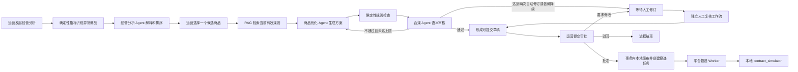
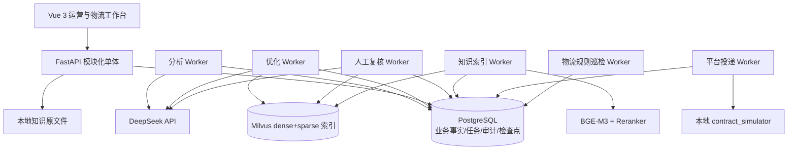

# 智营台：业务与技术说明

> 代码快照：`master` / `ebb4be01392d457b1634dbf790857b6aacaee64c`
>
> 核对日期：2026-09-21
>
> 项目定位：本地可复现的国内多店铺货架电商运营与物流协同演示系统

## 1. 当前真实状态

| 模块 | 当前状态 | 代码证据 |
|---|---|---|
| 认证、部门、角色和店铺授权 | 已实现前后端与后台任务复核 | `backend/auth.py`、`frontend/src/capabilities.ts` |
| 固定种子业务数据 | 已有后端实现及测试 | `backend/seed.py`、`tests/test_seed.py` |
| 经营指标与异常商品识别 | 已有后端实现及测试 | `backend/analytics.py` |
| 经营分析 Agent 与持久 Worker | 已有后端实现及测试 | `backend/analysis_agent.py`、`backend/analysis_worker.py` |
| 知识文档、版本、RAG 检索 | 已有后端实现及测试 | `backend/knowledge_*.py` |
| 商品优化 Agent | 已有后端实现及测试 | `backend/optimization_agent.py`、`backend/optimization_worker.py` |
| 确定性合规与语义合规 | 已有后端实现及测试 | `backend/optimization_validation.py`、`backend/compliance_agent.py` |
| 人工修订与再次复核 | 已有后端实现及测试 | `backend/manual_reviews.py`、`backend/manual_review_worker.py` |
| 提交、审批、驳回、要求修改 | 已有后端实现及测试 | `backend/approvals.py` |
| 本地发布、平台投递队列与审计 | 已实现；平台目标仍是本地契约模拟器 | `backend/approvals.py`、`backend/platform_delivery_worker.py`、`backend/audit_events.py` |
| Vue 运营管理台 | 已实现工作台、分析、方案、审批、知识、评测、调用记录、审计和系统管理页面 | `frontend/src/router.ts`、`frontend/src/pages/` |
| 物流协同工作台 | 已实现运单、轨迹、退货、异常工单、规则巡检、事实问答和 CSV 导出 | `backend/logistics.py`、`frontend/src/pages/LogisticsPage.vue` |
| 共享系统管理 | 管理员可维护用户角色、部门、状态、店铺启停和店铺授权 | `backend/admin_management.py`、`frontend/src/pages/SystemManagementPage.vue` |
| 真实电商平台或承运商集成 | 未实现 | 电商投递使用 `contract_simulator`；物流轨迹来自人工录入或演示数据 |

当前代码快照的既有验收证据为：后端离线回归 1145 passed、48 skipped，前端 Vitest 101 passed，TypeScript 检查和生产构建通过；另有运营、管理、物流、部门隔离、SQLite/PostgreSQL 迁移与并发授权验证。这里引用的是 [部门权限隔离验证](department-isolation-validation.md) 的 2026-09-21 记录，并非本文编辑时重新执行测试。48 个跳过项主要是需要显式开启的 PostgreSQL、外部模型等集成检查。

## 2. 业务问题

多店铺运营通常面对四个断点：

1. 数据很多，但运营每天仍要人工判断哪个商品最值得先处理。
2. 商品文案优化依赖经验，容易出现事实编造、违规宣传和规则引用不清。
3. AI 生成、人工修改、主管审批和最终发布之间缺少可恢复、可追溯的任务链。
4. 订单发出后，运单、时效、退货和异常处理分散，店铺范围和责任人难以统一管理。

智营台把运营和物流放在同一套身份、店铺范围和审计边界内。运营侧先用确定性指标发现问题商品，再让 LLM Agent 分别解释、生成和审核，最后把发布权保留给人；物流侧用确定性规则发现超时和停滞，不调用大模型。

## 3. 用户和权限

| 身份 | 核心职责 | 权限边界 |
|---|---|---|
| 运营员工 `operations + operator` | 发起分析、选择商品、查看与人工修订方案、提交审批 | 只能访问授权店铺，不能审批，不能访问物流 API |
| 运营主管 `operations + supervisor` | 查看运营任务、批准、驳回、要求修改、查看评测与审计 | 只能访问授权店铺，不能访问物流 API |
| 物流员工或主管 `logistics + operator/supervisor` | 登记和推进运单、退货、异常工单，运行规则巡检 | 只能访问授权店铺，不能访问运营、知识、评测或审计 API |
| 系统管理员 `admin` | 跨部门业务访问；维护知识、用户、部门、角色、状态、店铺及授权 | 不受普通店铺 scope 限制；管理页和知识写接口仅管理员可用 |

认证不是唯一安全边界。JWT 只标识身份；每次资源请求和关键后台写入都会从数据库重新检查用户是否启用、当前部门与角色、店铺授权、资源归属和业务状态。运营路由统一要求运营部门，物流路由统一要求物流部门，管理员是跨部门例外。前端路由只负责导航和体验，不能替代后端授权。

普通 seed 内置 `operator`、`supervisor`、`admin`，统一演示密码为 `DemoPass!2026`。独立物流演示启动器另建 `logistics`、`warehouse`、`operations`、`admin`，统一密码为 `Logistics!2026`；这些物流演示账号和 SQLite 演示库不会自动写入普通部署数据库。完整账号和迁移说明见 [物流使用指南](logistics-guide.md)。

## 4. 端到端业务闭环



### 4.1 经营分析

运营选择店铺和 1—90 天日期范围，API 只创建 `accepted` 任务，不在请求线程中调用模型。独立 Worker 领取任务后计算曝光、点击、订单、销量、销售额、退款、点击率、转化率、退款率、客单价和库存风险。

当前异常规则是可重复的演示规则：

| 异常 | 判定逻辑 |
|---|---|
| 低转化 | 点击数至少 50，且商品转化率低于店铺中位数的 60% |
| 销售下滑 | 当前周期销售额不高于上一等长周期的 70% |
| 高退款 | 销量至少 10，且退款率不低于 10% |
| 库存风险 | 当前库存不高于 `max(3, 近 7 天销量)` |

确定性代码决定候选集合、异常类型、指标和证据。经营分析 Agent 只能补充中文影响解释、原因、建议动作、排序和置信度，不能新增商品或改写业务事实。

### 4.2 商品优化

运营从分析候选中选择一个商品后，系统创建一个商品方案和一个优化工作流。可信输入由服务端重新加载，包括：

- 当前商品版本、标题、卖点、详情、关键词和属性；
- 当前 SKU、价格和库存；
- 已持久化的候选指标与证据；
- 当前有效且适用的知识引用。

优化 Agent 输出标题、卖点、结构化详情、关键词、属性补全、变更清单、引用、价格建议和 SKU 建议。所有字段经过 Pydantic 严格 Schema 和服务端证据 allowlist 校验。

价格和 SKU 在本项目中始终只是建议。人工修订不能改写引用、价格建议或 SKU 建议，模拟发布也不会应用它们。

### 4.3 双轨合规

合规不是单纯再问一次大模型，而是两条轨道合并：

- 确定性轨道：检查标题语言和长度、禁限词、声明与输出一致性、证据路径、引用有效性、属性来源、SKU 归属、价格精度和价格区间等。
- 语义轨道：由独立合规 Agent 判断夸大宣传、医疗化、误导、语义冲突、无法证明的承诺和证据不足。

合规 Agent 只返回问题和修改要求，不直接修改商品。自动优化最多形成 `iteration=0、1、2` 三个 Agent revision，即初稿加最多两次自动修订，防止无限循环。达到上限或外部依赖不可用时进入 `pending_manual/degraded`。

### 4.4 人工修订

运营、主管或管理员可以在 `draft_ready` 或 `pending_manual` 状态创建人工 revision。可编辑范围只有标题、卖点、结构化详情、关键词和属性补全。

每次人工 revision 会创建独立 `manual_review` 工作流，再次运行确定性检查和语义审核。系统校验父 revision、商品版本、可信事实哈希、引用仍为当前版本以及同一方案只有一个活动人工复核任务。

### 4.5 审批与模拟发布

只有 `normal + passed + no error` 的当前 revision 才能提交。主管或管理员可以：

- 批准：在一个数据库事务中写审批动作、更新商品文案和属性、版本号加一、写发布记录、创建平台投递任务并写审计事件。
- 驳回：流程进入 `rejected`，商品不变。
- 要求修改：清除已提交 revision，回到 `pending_manual`，允许再次人工修订和复核。

批准前会比较商品当前版本和方案基线版本。若商品已经被其他流程修改，返回版本冲突，不允许旧方案覆盖新商品。

### 4.6 平台投递边界

审批完成后的本地商品更新与外部投递结果分开保存。投递 Worker 使用客户端凭据获取令牌，以稳定幂等键发送文案字段，处理 401 换令牌、429、5xx、超时和有界重试，并在每次实际写请求前重新检查批准人仍有运营部门、审批角色和店铺权限。签名 Webhook 由 API 独立接收，验收脚本直接发送回调进行验证；本地契约模拟器不自动发送回调。

当前 `provider` 固定为 `contract_simulator`。仓库内的模拟器实现了 OAuth、商品写入、幂等冲突和故障注入，用于验证协议和恢复语义；它不是淘宝、京东或其他真实平台连接器，也没有经过真实商家认证。

### 4.7 物流业务闭环

物流账号可在授权店铺内把已有订单登记为运单，记录发货、运输和签收节点，查看承诺发货、预计到货、实际发货和实际签收时间；还可以创建并按合法状态推进退货、把异常分配给有相应店铺权限的有效物流用户或管理员，并填写结案记录。

物流 Agent 是确定性规则程序：发货超时、48 小时无轨迹、到货超时和退货处理超时会生成去重异常工单；问答只对已登记事实做关键词分类、汇总和运单引用。它明确不调用 DeepSeek，也不连接承运商。退货 `closed` 只表示逆向物流和验收闭环，不触发财务退款或库存变更。

## 5. 业务价值

本项目不声称已经提升真实销售额，因为没有接真实平台和线上实验。它能够证明的是：

- 把“找商品—改文案—审合规—人审批—留证据”变成可重复流程；
- 用确定性指标降低 AI 诊断的事实风险；
- 用引用、版本和人工节点让建议可解释、可复核；
- 用持久任务和幂等写入避免进程重启或重复点击造成重复副作用；
- 用统一店铺权限、轨迹、时效规则和异常工单串起物流处理；
- 为后续统计运营采纳率、审批通过率、自动修订次数、物流准时率和任务时长提供结构化数据。

真正的业务收益需要上线后通过 A/B 实验、处理时长、采纳率、违规率和转化指标验证。

## 6. 技术架构



分析、优化和合规 Agent 可调用 DeepSeek；物流巡检和物流问答只执行本地确定性规则。物流规则 Worker 不使用 LangGraph，平台投递 Worker 也不调用模型。

### 6.1 为什么是模块化单体

这是单机本地演示项目，没有真实高并发和跨团队独立发布需求。FastAPI、Worker 和领域模块保留清晰边界，但共享同一代码库和 PostgreSQL，减少微服务通信、部署和一致性成本。

### 6.2 为什么用 PostgreSQL 任务租约

项目已经依赖 PostgreSQL，首版无需再引入 Redis、Celery 或 Kafka。Worker 使用 `SELECT ... FOR UPDATE SKIP LOCKED` 互斥领取任务，记录 `lease_owner`、`lease_expires_at` 和 `attempt_count`：

1. 多个 Worker 不会领取同一条未锁定任务。
2. Worker 异常退出后，租约过期的任务可以被重新领取。
3. 所有续租和终态写入都校验当前 owner 和未过期租约，旧 Worker 不能覆盖新 Worker。
4. 尝试次数上限为 3，避免坏任务无限重领。

系统追求的是“至少一次执行 + 幂等副作用”，不是不现实的端到端 exactly-once 承诺。

### 6.3 LangGraph 的作用

LangGraph 负责表达节点、条件边、自动修订循环和恢复位置。`workflow_run.id` 用作 `thread_id`，PostgreSQL Checkpointer 保存节点进度。

PostgreSQL 业务表仍是最终事实源；checkpoint 只承载恢复所需的安全状态。恢复后，Worker 会重新校验数据库里的 owner、商品版本、当前 revision 和引用版本，不能只信 checkpoint。

### 6.4 LLM 调用边界

统一运行时 `DeepSeekJsonRuntime`：

- 请求 OpenAI 兼容的 `/chat/completions`，强制 JSON object；
- 只对 timeout、transport、429 和 5xx 做最多三次 HTTP 尝试；
- 缺 Key、401、403 和普通 4xx 不重试；
- JSON 或 Schema 错误可以进入一次独立 schema repair；
- 记录模型、Prompt 版本、输入哈希、Token、耗时、估算成本和安全错误码；
- 不保存密钥、Authorization 或隐藏思维链。

## 7. RAG 设计

### 7.1 写入链路

管理员上传 PDF、DOCX、Markdown 或 TXT。系统检查文件名、扩展名、MIME、魔数、大小、页数和解析质量，再按标题和段落分块。chunk ID 由版本哈希、序号和 chunk 哈希稳定生成。

BGE-M3 同时生成 1024 维 dense 向量和 sparse lexical weights，Milvus 保存可重建向量索引；PostgreSQL 保存规范正文、标题路径、文档版本和激活状态。

### 7.2 检索链路

1. PostgreSQL 先确定当前启用文档的 active version。
2. BGE-M3 生成查询 dense 和 sparse 向量。
3. Milvus 分别召回，使用 RRF 融合。
4. Reranker 对候选精排。
5. 返回前再次从 PostgreSQL 加载当前版本的 canonical chunk，过滤旧版、禁用或越权内容。
6. 根据离线校准阈值返回 `normal`、`zero_hit` 或 `low_confidence`。

当前校准文件选择 `hybrid_rerank`，`candidate_limit=10`、`rrf_k=60`、`threshold=0.2`。这些参数来自项目内演示评测集，不应被描述成适用于生产的通用最佳值。

### 7.3 为什么 PostgreSQL 和 Milvus 都要校验

Milvus 是检索加速索引，不是文档真相。即使旧向量尚未物理删除，只要 PostgreSQL 当前版本指针已经切换，旧 chunk 也不会进入最终引用。这样可降低索引更新窗口带来的旧规则污染。

知识内容被视为不可信输入，只能作为引用数据进入限定 Prompt，不能覆盖系统指令或授权工具。

## 8. 数据模型

当前 SQLAlchemy 模型共 32 张业务表，可分成六组：

| 分组 | 表 |
|---|---|
| 身份与授权 | `users`（含 `department`）、`stores`、`user_store_scopes` |
| 电商事实 | `products`、`product_skus`、`orders`、`order_items`、`traffic_daily`、`inventory_snapshots` |
| 工作流与 AI | `workflow_runs`、`analysis_candidates`、`agent_calls`、`product_proposals`、`proposal_revisions`、`compliance_reviews`、`manual_review_runs` |
| 评测与观测 | `evaluation_cases`、`evaluation_runs`、`evaluation_results`、`audit_events` |
| 审批、平台投递和知识 | `approval_actions`、`publish_records`、`platform_deliveries`、`platform_webhook_receipts`、`knowledge_documents`、`knowledge_document_versions`、`knowledge_chunks` |
| 物流 | `logistics_shipments`、`logistics_returns`、`logistics_events`、`logistics_exceptions`、`logistics_agent_runs` |

数据库约束覆盖角色、状态、金额、库存、日期、置信度、revision 父子关系、尝试次数、幂等哈希、商品版本递增和唯一业务键。服务层校验用于给出领域错误，数据库约束负责守住最终一致性。

## 9. 状态机

### 9.1 分析工作流

```text
accepted -> processing -> awaiting_selection -> completed
                      \-> failed
```

分析工作流在候选就绪时停在 `awaiting_selection`。运营选品后，分析工作流完成，并创建新的优化工作流。

### 9.2 优化工作流

```text
accepted -> processing -> draft_ready -> pending_approval -> completed
                      \-> pending_manual -> processing ...
                      \-> failed
pending_approval -> rejected
pending_approval -> pending_manual   # request_changes
```

生命周期状态和质量状态分离：任务可以到达可处理状态，但质量为 `degraded`。这避免把“流程完成”和“结果可信”混为一谈。

## 10. API 概览

| 领域 | 主要接口 |
|---|---|
| 认证与共享基础数据 | `POST /auth/login`、`GET /auth/me`、`GET /stores` |
| 经营分析 | `POST /analysis-runs`、`GET /workflow-runs/{id}`、`GET /analysis-runs/{id}/candidates` |
| 选品与方案 | `POST /analysis-runs/{id}/select-product`、`GET /proposals/{id}` |
| 人工修订 | `POST /proposals/{id}/manual-revision` |
| 审批 | `POST /proposals/{id}/submit`、`GET /approvals`、`POST /approvals/{id}/approve|reject|request-changes` |
| 评测、调用记录与审计 | `GET /agent-evaluations/runs`、`GET /agent-calls`、`GET /audit-events` |
| 知识库 | 上传文档、增加版本、列表、停用和检索接口 |
| 系统管理 | `GET /admin/users`、`PATCH /admin/users/{id}`、`PUT /admin/users/{id}/store-scopes`、`GET /admin/stores`、`PATCH /admin/stores/{id}` |
| 物流 | `/logistics/dashboard`、`/logistics/shipments`、`/logistics/returns`、`/logistics/exceptions`、`/logistics/agent/*` |
| 平台回调 | `POST /integrations/platform/webhooks`，使用独立签名验证而非用户 JWT |

分析、优化、人工复核和知识入库等后台任务在新建受理时返回 HTTP 202，由客户端查询对应任务或版本状态。选品、人工修订、提交和审批等写操作要求 `Idempotency-Key`；相同键和相同请求返回原结果，相同键配不同请求返回 409。

## 11. 一致性、幂等与安全

### 11.1 幂等分层

- API 层：校验 `Idempotency-Key`，保存请求哈希。
- 数据库层：使用 proposal、actor、action 和键哈希的唯一约束。
- 工作流层：revision、review 和 Agent 调用使用稳定唯一键，恢复时 exact replay。
- 发布层：一个 proposal 和 revision 只能生成一条发布记录，发布幂等哈希由稳定业务 ID 生成。

### 11.2 发布事务

批准使用单一事务和行锁。事务内同时完成商品快照更新、版本加一、审批动作、发布记录、平台投递任务、审计事件和工作流终态。任一步失败都回滚，不留下“商品已改但发布记录没写”之类的半状态。

### 11.3 审计最小化

审计事件只允许固定字段，如状态变化、revision 编号、质量、风险、变更字段和版本号。正文、Prompt、访问令牌、密码和密钥不能进入审计详情，详情编码后还有 4 KB 上限。

### 11.4 资源防越权

- JWT 只确认身份，用户状态和权限每次从数据库加载。
- 店铺 scope、资源 store_id 和业务关系都会交叉校验。
- 敏感方案接口对不存在和无权访问统一返回安全的 404 语义，减少资源枚举。
- ORM 参数化查询，模型不能生成任意 SQL。

## 12. 测试策略

测试覆盖以下层级：

- 纯逻辑：指标、异常阈值、Schema、证据引用、确定性合规和状态转换。
- API：认证、RBAC、店铺隔离、输入校验、幂等重放和稳定错误码。
- Worker：领取、续租、租约丢失、重领、checkpoint 失败、取消和 exact replay。
- 数据库：真实 PostgreSQL `SKIP LOCKED`、并发动作、唯一约束、事务回滚和迁移。
- 外部依赖：DeepSeek MockTransport 的 timeout、429、5xx、结构错误和降级；Milvus/BGE 的显式 opt-in 集成测试。

需要区分三种证据：普通离线测试、需要 PostgreSQL/Milvus 的 opt-in 集成测试、需要真实 DeepSeek Key 的 smoke。它们不能混写成一次“全量测试”。当前快照的已记录结果见 [部门权限隔离验证](department-isolation-validation.md)；本文没有重新运行这些门禁。

## 13. 前端实现

前端采用 Vue 3、TypeScript、Vite、Vue Router 和 Element Plus，源码位于 `frontend/`：

- 登录后用 `sessionStorage` 保存 Bearer Token，并通过 `/auth/me` 恢复数据库身份；
- 运营首页是任务工作台，物流首页是物流总览；
- 工作台从服务端恢复任务，不在浏览器里保存业务 ID 伪造可恢复状态；
- 运营桌面端提供工作台、分析、方案、人工修订、审批、知识、评测与调用记录、审计和系统管理；
- 物流页面覆盖总览、运单、退货、异常工单和规则 Agent，并提供响应式手机布局；
- 手机端不提供知识、Agent 观测、审计和系统管理；发起分析、选品和编辑方案也限定桌面，主管或管理员仍可在手机审批；
- 使用串行轮询，终态、卸载、路由离开或退出时取消；
- 引用、价格建议和 SKU 建议只读；
- 未引入 Pinia、Axios、Tailwind 或图表库；当前使用浏览器 `fetch`、组合式状态和 CSS。

前端路由按部门选择登录落点并隐藏越权入口，后端仍是最终授权边界。管理员系统管理页只在桌面开放；知识管理写操作仅管理员可用，评测、调用记录和审计面向运营主管与管理员。

## 14. 运行与设置

普通部署需要 Python 3.11、Node.js、PostgreSQL，以及知识检索使用的 Milvus、BGE-M3 和 BGE Reranker。`docker-compose.yml` 提供 PostgreSQL、Milvus、etcd 和 MinIO；前端用 `npm --prefix frontend ci` 安装并构建。应用必须设置 `JWT_SECRET_KEY`，数据库 URL、LangGraph 数据库 URL、模型目录、Milvus 地址和知识上传目录必须在 API 与 Worker 间保持一致。

DeepSeek Key 只对分析、优化和语义合规调用必需；未配置时分析可产生有明确质量状态的确定性降级解释，优化或合规不能伪装成正常结果。知识上传、索引和检索需要本地模型与 Milvus，且只有管理员能在界面维护文档；其他运营角色只能在业务授权范围内使用检索。

运营闭环需要分别运行分析、知识索引、优化和人工复核 Worker。平台投递 Worker 还要求显式设置 `RUN_PHASE10_PLATFORM_DELIVERY=1` 以及完整的平台地址、客户端凭据和 Webhook 密钥，否则拒绝启动。物流可以在页面手动巡检，也可以用 `scripts/run_logistics_worker.py --username <物流账号>` 定时巡检；该账号的部门、状态和店铺范围每轮都会重新验证。

最简物流演示可执行仓库根目录的 `start-logistics.ps1`，使用独立 SQLite 数据库，不需要 Docker、Milvus 或模型密钥。普通部署使用 PostgreSQL 并执行 `python -m alembic upgrade head`。完整命令见 [README](../README.md) 和 [物流使用指南](logistics-guide.md)。

## 15. 已知限制和下一步

1. 系统仍是单机演示架构；没有生产身份提供商、密钥托管、监控告警、数据保留策略或高并发容量证明。
2. 经营分析和部分物流聚合使用适合演示规模的逐项或内存计算；生产规模应改成批量 SQL、预计算或数仓指标层。
3. 当前规则和评测集是平台中立演示资料，不是淘宝、京东、承运商或法律法规的正式规则库，也不能证明真实业务泛化效果。
4. 平台客户端和投递 Worker 已实现协议、幂等、重试与回执，但当前只连接仓库内 `contract_simulator`，没有真实商家 OAuth 或生产 API 验证。
5. 物流没有实时承运商轨迹；数据来自人工登记或演示 seed。退货结案不触发退款或库存变更。
6. 发布不应用价格、SKU 或库存建议。真实价格、库存和财务变更需要独立权限、审批和平台适配。
7. DeepSeek、Milvus、本地模型和 PostgreSQL 的真实集成测试均为显式 opt-in；引用测试数字时必须注明验证日期和测试类型。

## 16. 面向简历的准确表述

可以表述为：

> 设计并实现本地多店铺电商运营与物流协同平台：以 Vue 3 和 FastAPI 交付运营、审批、知识、评测、审计、系统管理与物流工作台；使用 PostgreSQL 租约队列和 LangGraph Checkpointer 编排经营分析、商品优化与合规 Agent，通过 BGE-M3、Milvus、RRF 和 Reranker 建立版本化混合检索，并以部门和店铺授权、严格 Schema、可信事实、人工审批、幂等本地发布、契约模拟投递和安全审计控制风险。

暂时不要表述为：

- 已上线生产；
- 已接入淘宝或京东；
- 已真实提升 GMV 或转化率；
- 已连接真实电商平台或实时承运商；
- 物流巡检 Agent 使用了大模型；
- 已自动应用价格、SKU 或库存修改；
- 当前校准指标代表真实业务泛化效果。
