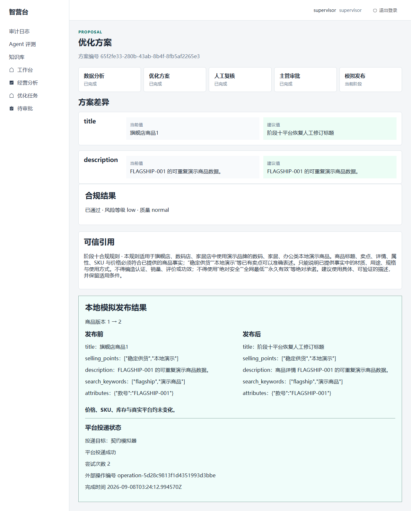

# 第十阶段验证报告

## 验收范围

依据[阶段十规格](superpowers/specs/2026-09-07-phase-10-production-validation-design.md)，验证持久平台投递、受控真实 DeepSeek 调用、本机 PostgreSQL／Milvus／BGE、故障恢复及无业务拦截的浏览器流程。平台目标始终为 `contract_simulator`，数据为合成演示数据。

计划内开发与运行验证已完成。下文保留原始失败、修复和复验记录，分别列出真实模型验证、确定性本地模型 E2E 及普通回归证据。

## 提交链

设计 `6de0397`，计划 `bbfb7eb`。实施基于隔离分支 `codex/phase10-platform-delivery`，主检出和远端未更新。

| 范围 | 提交（按实际先后） |
|---|---|
| 持久投递与平台契约 | `265fac8`、`3268c7f`、`11f6063`、`027387f`、`1bda6c7`、`298a185`、`3ce186f`、`87f2fda`、`c718ba2`、`a09ac09`、`24dad8b`、`2ce31a2`、`bc17ee7` |
| 故障、真实服务与模型验证 | `352063b`、`ad284a5`、`71e0dbd`、`8350f10`、`d6cf03d`、`9dead6f` |
| 确定性模型服务、独立栈启动器与浏览器流程 | `8a8249d`、`842648c`、`22ad1a7`、`ea81dc7` |
| E2E 修正与最终审查修复 | `0ba69b5`、`e57477d` |
| 模型输出与实际 Worker 落库契约 | `6733f93` |
| 浏览器渲染文本比较 | `bba299a` |
| 浏览器请求关联与响应读取时序 | `c413a02` |
| 审计控件选择与安全文本边界 | `b939093` |
| Worker 恢复探针父进程配置隔离 | `fd965fb` |
| 完整成功运行截图 | `d1100db` |

## 环境版本

| 组件 | 实际版本 |
|---|---|
| Python / Node.js / npm | 3.11.15 / 24.15.0 / 11.12.1 |
| Docker / PostgreSQL | 29.7.2 / 16.15 |
| Milvus / etcd | 2.5.6 / 3.5.18 |
| MinIO | RELEASE.2023-03-20T20-16-18Z |
| FastAPI / SQLAlchemy / httpx | 0.141.1 / 2.0.52 / 0.28.1 |
| LangGraph / torch | 0.6.11 / 2.13.0+cu130 |
| FlagEmbedding / pymilvus | 1.4.2 / 2.6.17 |
| pytest / Playwright | 8.4.2 / 1.62.1 |

本地检索模型为 `bge-m3` 与 `bge-reranker-v2-m3`。复用已有健康的本机基础设施；未删除共享 Docker 卷或默认数据库。

## 普通回归

Plan 1 在 `bc17ee7` 完成：后端 **1018 passed / 41 skipped**（539.75 秒），前端 **82 passed**，fixture Playwright **9 passed**；配置中的类型检查命令、构建、compileall、Compose 配置与 Git 差异检查通过。这是该提交的历史阶段证据，最终代码的全量结果另列如下。

Plan 2 故障相关回归 **201 passed**；优化模板修复相关回归 **283 passed**；失败证据修复相关回归 **39 passed / 3 skipped**。这些离线测试没有真实模型调用。

2026-09-08 恢复后的全量回归，在 `842648c` 运行 `python -m pytest -q --tb=short`：**1074 passed / 44 skipped**，197.62 秒；所有真实调用开关和模型密钥仅从测试子进程移除。前端 `npm --prefix frontend test -- --run`：**82 passed**，32.71 秒；`typecheck`、`build` 通过；默认 `test:e2e`：**9 passed**，24.9 秒。真实服务 E2E 与这 9 个 fixture 场景分开计数。

最终审查修复后，同一全量后端命令在 `e57477d` 代码上再次执行：**1081 passed / 45 skipped**，221.84 秒。新增检查覆盖模型服务生产校验、同商品投递顺序和 Windows 环境隔离；跳过项均为显式 opt-in 集成验证。

2026-09-08 在 `bba299a` 后端代码上完成最终全量后端回归：**1084 passed / 45 skipped**，197.29 秒，退出码 0；其中包含 canonical citations 与实际 Worker 持久化的新增用例。运行期间仅有尚未提交的浏览器测试修订及交付文档草稿。

纳入 `fd965fb` 的 Worker 恢复探针修复后，再次全量运行：**1087 passed / 45 skipped**，186.10 秒，退出码 0；包含三个新回归。该次测试显式使用专用临时目录，所有 `RUN_*` 开关和真实模型密钥均从测试子进程移除。

## PostgreSQL

Plan 1 完成唯一迁移 `0007` 的升降级、当前版本和模型差异检查，真实约束、原子审批及并发领取验证通过。Plan 2 联合运行：

```powershell
python -m pytest tests/test_phase10_postgres.py tests/test_phase9_postgres.py tests/test_analysis_postgres.py tests/test_optimization_postgres.py tests/test_manual_review_postgres.py -q --tb=short
```

在独立进程设置 `RUN_POSTGRES_INTEGRATION=1`：Plan 2 **34 passed**，56.62 秒；2026-09-08 恢复后的最终联合门禁再次 **34 passed**，57.96 秒。`python -m alembic current` 为 `0007 (head)`，`python -m alembic check` 显示无新增迁移操作。`python -m compileall -q backend scripts alembic tests/support`、`docker compose config --quiet` 和 `git diff --check` 均通过。

纳入同商品顺序修复后，在 `bba299a` 后端代码上再次执行上述五文件联合门禁：**35 passed**，65.85 秒，退出码 0。随后复核 Alembic `0007 (head)`、无迁移漂移、compileall、Compose 配置和差异检查，均通过。

## Milvus 与本地 BGE

```powershell
python -m pytest tests/test_knowledge_integration.py tests/test_optimization_rag.py -q
```

独立测试进程启用 `RUN_KNOWLEDGE_INTEGRATION=1` 和 `RUN_POSTGRES_INTEGRATION=1`，真实模型密钥不传入，Hugging Face 保持离线。

首次 **18 passed / 1 failed**（78.20 秒）。发现旧 fixture 的并发领取记录干扰后续恢复，以及删除测试用户前遗漏该用户审计记录。仅修复本轮精确 ID 的 fixture 清理，未放宽业务断言；独立审查后复验 **19 passed**（46.54 秒）。真实写入、检索、引用、停用与恢复均通过。Milvus timeout 离线故障注入已纠正到实际索引边界。

## 真实 DeepSeek 受控验证

使用显式 opt-in、合成可信输入与 `deepseek-v4-flash`，每个 Agent 最多一次主调用和一次 schema 修复。普通测试及 E2E 不使用真实 DeepSeek。时间均为北京时间。

2026-09-07 20:14 首次整组运行 `python -m pytest tests/test_phase10_deepseek.py -m phase10_deepseek -q -s --tb=no --show-capture=no --disable-warnings`：**2 passed / 1 failed**，81.41 秒。

| Agent | 原始结果 |
|---|---|
| 分析 | 主调用 schema 校验失败，执行一次 schema 修复后通过，共 2 次 HTTP 调用 |
| 合规 | 主调用通过，共 1 次 HTTP 调用 |
| 商品优化 | 失败；当时测试只输出成功摘要，精确失败短码和调用次数未留存，不能追溯推断 |

后续离线复现发现优化响应模板的 description 未完整声明变更且长度上界不匹配；`d6cf03d` 修复模板并升级到 `product-optimization-v4`。这不能证明是历史真实调用失败的原因。`9dead6f` 补齐真实测试失败分支的闭集安全摘要，并以离线 transport 验证超时、schema、业务校验及未知失败分类。

用户另行明确授权**仅商品优化 Agent 重验一轮**。2026-09-08 08:32 在 `9dead6f` 执行 `python -m pytest tests/test_phase10_deepseek.py::test_live_phase10_optimization_contract -q -s --tb=no --show-capture=no --disable-warnings`：**1 passed**，27.47 秒。

| 模型 / Prompt 版本 | 调用 | 耗时 | Token | 错误码 / 费用估算 |
|---|---|---|---|---|
| `deepseek-v4-flash` / `product-optimization-v4` | 1 次 primary，0 次 repair | 27293 ms | 输入 1246、输出 3272、总计 4518 | 无 / 未提供 |

原始失败和额外授权后的成功摘要均保留，未保存 Prompt、原始响应或密钥。独立审查确认上述证据后批准 Plan 2。真实调用授权已消耗，未为 E2E 或报告重复调用。

## 平台故障矩阵

| 边界 / 故障 | 已验证的语义 |
|---|---|
| DeepSeek 超时、429、非法 JSON | 有界调用、安全短码、至多一次 schema 修复 |
| Milvus 超时、空命中 | 明确失败或零命中，不伪造引用 |
| 平台 Token 过期 | 一次刷新，保持投递幂等键 |
| 平台 429、5xx、超时 | 有界重试，持久状态和下次执行时间 |
| 接受写入后断开连接 | 相同幂等键与操作 ID，仅一次平台副作用 |
| 租约过期、旧 owner 提交 | 新 owner 恢复，旧 owner 无权写终态 |
| Webhook 签名错误、过期、篡改事件 ID | 拒绝，零接收事实与接受审计 |
| 重复 Webhook | 一条 receipt、一条接受审计 |
| 重复批准 | 一个批准事实、一个本地发布、一个平台投递 |
| 同商品连续版本投递 | 未完成的旧版本阻止新版本被领取；不同商品仍可并发，旧版本终态后释放后继 |

表中为已通过的离线与 PostgreSQL 证据；真实 E2E 中 HTTP 故障和进程中断的实际结果在下节单独记录。

最终整分支审查发现，单纯按创建时间排序不能阻止新版本越过等待重试或处理中的旧版本。修复在现有领取查询中按不可变发布记录的商品和版本检查前序投递，不新增表或队列。回归覆盖延迟重试、处理中、成功／失败后的释放，以及 PostgreSQL 持锁期间其他商品仍能领取。联合投递、启动器和 Phase 10 PostgreSQL 门禁 **61 passed**，7.00 秒。

## 真实服务浏览器 E2E

唯一入口：`python scripts/run_phase10_e2e.py`。三个组件独立审查通过后，2026-09-08 09:40 在 `ea81dc7` 首次运行，运行标识 `f48eecef`。迁移、种子数据、checkpoint 初始化、前端构建均通过；首个浏览器场景等待初始优化方案超时，后续两个串行场景未执行。进程退出码为 1。

失败截图显示人工处理阶段、尚无修订。启动器执行清理后，另行只读检查确认本轮数据库和 Milvus 集合不存在，端口及 Worker 进程已释放。原始业务响应未保存，因此不能唯一追溯当时的优化错误码。

有界本地诊断通过生产排序与只读合成数据确认首个候选及其检索 query，再运行真实本地 BGE：原始知识 fixture 重排分数为 **-5.01171875**，低于生产阈值 **0.2**，足以稳定触发 `KNOWLEDGE_LOW_CONFIDENCE` 并进入人工处理。补充合成店铺、商品类别及既有事实适用范围后，同一边界的分数为 **5.21875**。禁止编造和绝对承诺的规则保留，生产阈值未修改。该诊断复现了具体阻断原因，但不排除历史运行还存在其他问题。

浏览器等待逻辑增加闭集状态、质量和错误短码诊断，并在初始优化进入人工处理或失败时及时退出。首次浏览器运行还暴露了缺失 Windows 环境变量引发输入法缓存落到工作区的问题；生成文件已保留到该轮临时目录，`e57477d` 将 Windows profile、ProgramData 和变量展开路径隔离到本轮临时目录，原生 Windows 检查通过。

上述修复独立审查通过后，2026-09-08 10:08 在 `e57477d` 第二次运行，标识 `3cd43285`。初始化门禁均通过，首个浏览器场景因 `status=failed / quality=normal / error_code=OPTIMIZATION_FACT_ERROR` 及时失败，退出码 1；两个后续串行场景未执行。本轮数据库与集合已确认清理，工作区没有再出现输入法缓存。

离线实际 Worker 回归复现第二次错误：测试模型未列出 canonical citations，schema 和业务校验通过，但落库所需的完整可信引用集合不匹配。`6733f93` 仅用五行测试服务代码列出可信有效引用，生产校验和持久化规则保持不变。实际客户端／持久化正反检查及完整 Worker 回归由 **2 failed / 1 passed** 转为 **3 passed**；扩展回归 **212 passed**，独立复验 **167 passed**。

审查明确批准后，于 2026-09-08 10:17 启动第三次完整运行 `d2f5d9d0`。真实分析、优化、人工复核、批准及本地发布完成；只读数据库检查确认平台投递 `succeeded`、尝试次数 **2**、错误码为空。但首个浏览器场景将 `innerText` 基线交给默认 `textContent` 断言，换行差异导致超时，完整运行退出码仍为 1。`bba299a` 将四处同类断言统一使用原生 `useInnerText` 选项，完整内容相等比较继续保留，经 AST 和 Playwright 原生实现独立核验。

2026-09-08 10:26，经批准启动第四次完整运行 `698ea174`。初始化门禁通过，浏览器在读取 API 响应正文时遇到导航后的 Chromium 缓存失效，运行退出码 1。保留的错误未包含请求身份，不能确定具体失败请求。`c413a02` 将七处响应捕获统一到现有 helper：绑定新发出的请求，并发尽早读取正文；硬导航仅在主框架提交后接受请求。实际源码离线探针由三个失败转为三个通过，独立审查再核验查询过滤和失败清理，共五项通过。原业务断言和重试次数不变；离线探针不等同于 Chromium 真实复现。

第四次失败后，另行只读核对上述四个运行标识：对应 PostgreSQL 数据库与 Milvus 集合均不存在，三个 E2E 服务端口均已释放。

2026-09-08 10:45，经独立审查明确放行，在 `c413a02` 启动第五次完整运行 `9e81e237`。首个发布与平台恢复场景完成并生成截图；第二场景已执行真实驳回，但 `getByLabel('审批动作', { exact: true })` 未定位到审计下拉框，达到 300 秒测试超时。收尾安全检查又将合法事件选项 `authorization_denied` 误匹配为 `Authorization`，再等待 120 秒后失败。完整运行退出码 1，第三场景未执行；本轮截图不作为完整验收交付物。

第五轮结束后，另行确认本轮数据库与集合不存在，三个服务端口均释放。

`b939093` 仅修改三行测试：两处控件改用原生 combobox 的精确可访问名称，授权头检查增加词尾边界。真实 Chromium 离线探针使用生产标签模板和本地 Vue 渲染：旧标签匹配数为零，新角色匹配数为一；选择 `reject` 和清空均通过。三个旧失败转为通过，四个安全样本和十八个泄露正控通过，零网络请求。独立审查确认原业务断言、筛选值和泄露类别保留后，2026-09-08 11:04 在该提交启动第六次完整运行 `6f663768`。

第六次 **3 个浏览器场景通过**，只读数据库证明价格、SKU、库存未变，仅成功商品版本递增，两个失败人工修订不可变，且只有一条发布与投递。Webhook 实测证明非法签名、过期时间和篡改事件零写入，重复事件只有一条 receipt 与审计；模拟器为两次投递尝试、一次操作、一次副作用。随后 Worker 恢复探针初始化失败，完整退出码仍为 1，Milvus 不可用检查未执行。

启动器父进程没有 JWT 配置，故障探针仅为计算演示店铺 ID 导入 `backend.seed`，间接触发应用配置加载。相同父环境的新进程已独立复现 `jwt_secret_key` 缺失的配置异常；工作进程使用的合成配置正常。修复后从本轮已有数据库连接读取唯一的旗舰店 ID，缺失时明确失败，并以固定阶段名记录恢复探针失败。新进程回归证明不依赖父进程 JWT、不改变环境，并保留原租约和旧 owner 断言；启动器专项 **27 passed**，1.81 秒。该回归不等同于真实 Worker 恢复成功。

第六轮资源已另行确认清理。`fd965fb` 经独立审查后，于 2026-09-08 **11:23:00** 启动第七次完整运行 `07c061d0`，**11:24:56** 完成。启动器返回 `PHASE10_E2E_PASSED`，退出码 **0**。

| 第七次实际验证 | 结果 |
|---|---|
| 无业务 API 拦截的浏览器场景 | **3 个通过**：发布恢复、主管驳回、两次明确人工修订分别合规失败 |
| 平台接受后断线重放 | **2 次尝试、1 个操作、1 次副作用**；页面版本从 1 增至 2 |
| 数据库前后证明 | 价格／SKU／库存未变，仅成功商品版本递增；唯一发布及投递；失败人工修订 ID 不同且首份 SHA256 不变 |
| 真实 Webhook | 非法签名、过期时间戳、篡改事件 ID 均零写入；重复事件仅一条 receipt 和接受审计 |
| 实际 Worker 中断／恢复 | 模型请求中断时终止进程，新 Worker 在租约到期后恢复；`attempt_count=2`、`awaiting_selection`，旧 owner 写入被拒绝 |
| Milvus 实际不可用边界 | 拒绝连接时产生可重试的 `KNOWLEDGE_MILVUS_UNAVAILABLE`；边界为依赖启动，未伪称持久工作流失败 |
| 清理 | 启动器清理通过；另行只读确认七轮数据库和集合均不存在，服务端口及相关 Python 进程为零 |

仅下列第七轮成功截图进入 Git，前六轮失败或部分成功截图不作为最终交付证据。复制文件 SHA256 为 `65a3146313cf6e255be265e970f41593268e49bb193f2a980bbc387de3cd6ca0`，与成功运行原文件一致。



三个场景覆盖成功发布与平台断线重放、主管驳回、两次明确人工修订各自合规失败。失败修订必须有不同不可变 revision ID；第一次输出的 SHA256 在第二次编辑前保存，最终由只读数据库证明未变。价格、SKU 和库存由本轮数据库前后快照验证。

首次运行前预检发现新数据库 checkpoint 初始化竞争及多进程 BGE 显存压力。修复方向为启动 Worker 前串行初始化 checkpoint，知识 Worker 使用 CPU。显存压力是预检风险，不是已经观察到的 OOM。

## 敏感信息检查

最终检查覆盖 **218 个受跟踪及交付文件**、**33 个明确限定的运行证据文件**，配置中的真实 DeepSeek 密钥零命中。结构化证据不含原始 Prompt／响应、授权头、密码或令牌字段；README 和报告没有带凭据的数据库 URL 或本机私有绝对路径。检查明确排除三项用户自有受保护内容，不扫描模型、个人缓存或整个证据父目录。

已目视核验第七轮截图：仅包含合成商品内容、可信规则引用和安全发布／投递状态，不含令牌、URL 凭据、个人路径或原始模型请求。只提交该 PNG、README 和验证报告；完整运行目录、失败截图、浏览器上下文和临时探针保留于本机，不进入 Git。

## 已知非阻塞问题

- LangChain pending-deprecation 提示；Vite 构建存在大 bundle 提示。
- 配置中的 `npm run typecheck` 退出码为 0，但根 tsconfig 使用空文件列表与项目引用，该命令不能证明整个应用和 E2E 文件通过严格类型检查。额外直接检查应用配置发现既有应用／依赖类型错误；独立检查 E2E 文件受缺失 `@types/node` 限制。构建、运行测试和类型检查的证据分别记录，不将配置命令成功等同于完整类型安全。
- 初次商品优化真实失败证据不完整，保留为明确历史限制；后续测试已补齐安全失败摘要。
- 平台是本地契约模拟器，未进行真实商家认证、正式 OAuth 或生产接口联调。

## 最终结论

第十阶段开发及计划内运行验证已完成，最终独立验收批准，无未解决的 P1/P2。最终全量后端 **1087 passed / 45 skipped**，PostgreSQL **35 passed**；前端 **82 passed**、fixture 浏览器 **9 passed**、真实服务浏览器 **3 个通过**分别计数。真实 DeepSeek 的首次失败与单独授权重验成功均保留，E2E 使用确定性本地模型服务；真实本地 PostgreSQL、Milvus、BGE、HTTP 故障和 Worker 进程恢复均已实际执行。

完整 TypeScript 检查的覆盖缺口与既有错误如上所列，不能将配置命令成功等同于全面类型安全。没有真实商家凭据、OAuth 授权、生产 API 联调或真实商品写入证据；平台仍为本地契约模拟器。全部交付位于隔离分支，未合并、推送或部署。
